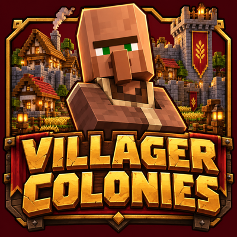

# Villager Colonies



Build a settlement, recruit villagers, and give them jobs like farming, mining, cooking, and crafting. Keep your people fed, organize supplies, and decide how your town grows.

Trade with other settlements, play alongside friends, and equip guards to defend against raids. When you're ready, lead your guards out to clear bandit camps and establish outposts.

**Villager Colonies is playable and still in development.** The current public version is **0.1.0.1**, a bugfix update for citizen jobs and recovery.

Formerly **World War MC**. The internal mod ID and JAR prefix remain **`wwmc`** so existing worlds, commands and configuration files stay compatible.

[CurseForge project](https://www.curseforge.com/minecraft/mc-mods/world-war-mc) · [All guides](docs/README.md) · [Changelog](docs/CHANGELOG.md) · [Roadmap](docs/ROADMAP.md) · [Report a bug](https://github.com/Swishhyy/Villager-Colonies/issues)

**On this page:** [Features](#features) · [Install](#install) · [Get started](#get-started) · [Guides](#guides) · [Build from source](#build-from-source)

## Features

- **A working town:** named citizens, dedicated job stations, housing, warehouses, and couriers.
- **Production:** farms, lumber work, mines, quarries, cooking, crafting, smelting, enchanting, and equipment repair.
- **Friends and trade:** town permissions, alliances, and traders who carry goods between settlements.
- **Defense and exploration:** guards, patrols, raids, bandit camps, and supplied outposts.
- **Visible progress:** job outfits and work effects, town colors, upgrades, research, a visual handbook, and tutorial advancements.

Larger warfare systems, countries, automatic building, and distant settlement simulation remain [planned features](docs/ROADMAP.md).

## Install

| Requirement | Version |
| --- | --- |
| Minecraft Java Edition | **26.2** |
| Mod loader | **NeoForge 26.2.0.88 or newer for Minecraft 26.2** |
| Java | **25** |
| Villager Colonies | **0.1.0.1** |

1. Install NeoForge for Minecraft **26.2**.
2. Download the Villager Colonies JAR from [GitHub Releases](https://github.com/Swishhyy/Villager-Colonies/releases/latest), [CurseForge](https://www.curseforge.com/minecraft/mc-mods/world-war-mc), or a successful [GitHub Actions build](https://github.com/Swishhyy/Villager-Colonies/actions/workflows/build.yml).
3. Place **`wwmc-0.1.0.1.jar`** in the instance's **`mods`** folder. If you downloaded an Actions artifact, extract its ZIP first.
4. For multiplayer, install the **same Villager Colonies version on the server and every client**.

Keep only one Villager Colonies JAR in the folder. Use a test world or back up an existing world before updating.

## Get started

1. **Open the guide.** Craft a **Settlement Guide** from **one book and one blue dye**, then right-click it. Press **L** for the tutorial advancements.
2. **Found your town.** Place a **Settlement Banner** on open, solid ground and right-click it with an empty hand.
3. **Add housing and supplies.** Put beds near a **Housing Station** and chests or barrels near a **Warehouse Station**. Ordinary stations detect furniture within **three blocks on each axis**.
4. **Set up your first jobs.** Add a **Farm Station**, a **Lumber Station**, and a **Courier Station**. Put barrels beside the work stations and stock food, tools, and saplings in the warehouse.
5. **Recruit citizens.** Use the settlement banner's screen to recruit and manage jobs. Add a **Cook Station** and the other jobs you need as the town grows.

Right-click a banner, station, or citizen to open its screen. The banner's **Needs** tab helps you find shortages; **Relationships** manages player access and town alliances. Press **?** on a town or station screen for relevant help.

Most job blocks employ **one citizen**; quarries support a crew. Injured citizens recover in **Hospital Station beds**, rather than by eating.

## Guides

| I want to... | Read this |
| --- | --- |
| Learn stations, recipes, jobs, and storage | [Settlement guide](docs/settlement-guide.md) |
| Fix cooking, improve yields, or heal citizens | [Production and recovery](docs/production-recovery.md) |
| Invite friends, trade, lead squads, and build outposts | [Multiplayer and campaign](docs/multiplayer-campaign.md) |
| Recover a server with missing Overworld settings | [Server startup help](docs/server-startup.md) |
| See what changed or what comes next | [Changelog](docs/CHANGELOG.md) · [Roadmap](docs/ROADMAP.md) |
| Understand the code, tests, or publication process | [Development guide](docs/development.md) · [CurseForge publishing](docs/curseforge.md) |

## Build from source

Use a **Java 25 JDK** and the included Gradle wrapper.

```bash
./gradlew build
./gradlew runClient
```

On Windows, use `gradlew.bat build` and `gradlew.bat runClient`. The mod JAR is written to **`build/libs/`**. See the [development guide](docs/development.md#build-and-verify) for world tests, server runs, and source layout.

## License and inspiration

Original mod code is [MIT licensed](LICENSE). The NeoForge starter notice is preserved in [TEMPLATE_LICENSE.txt](TEMPLATE_LICENSE.txt).

Inspired by [Colony Survival](https://store.steampowered.com/app/366090/Colony_Survival/). Villager Colonies uses original code and assets and does not include Colony Survival content.
